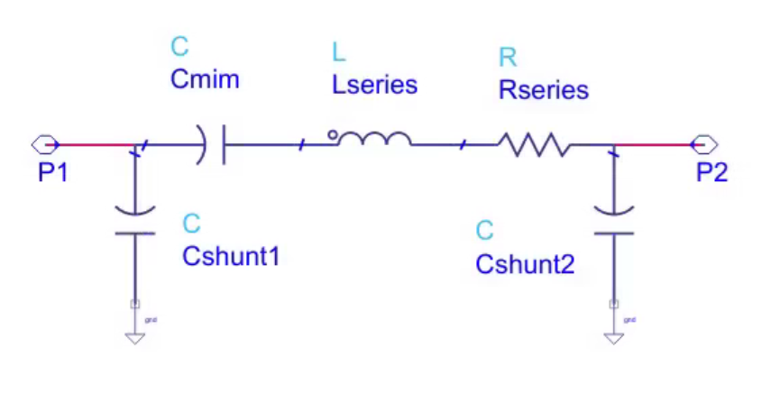

# mim_from_s2p

This tool reads S-parameter data (*.s2p) for a MIM capacitor and
calculates component values for a wideband model including SRF.



The S-parameters at two frequencies are evaluated: the target RF frequency
and a low frequency that allows to extract the series C value without 
parasitic inductance.

From that low frequency C and the series impedance at the target frequency, 
the parasitic series L (resulting from device size and interconnect)
is extracted. 

Series resistance and shunt capacitance are extracted at the specified 
target frequency.

The shunt capacitance is split equally to both ports, which is valid 
because they are tighly coupled through the large MIM value anyway,
and it is the total amount of shunt C that matters. 

A plot shows the effective series L over frequency, with markers at 
the target frequency and the low frequency point. For comparison,
the C curve for the fitted model is included in the plot.


# Prerequisites
The code requires Python3 with the skitkit-rf library.
https://scikit-rf.readthedocs.io/en/latest/tutorials/index.html

# Usage
To run the MIM model extraction, specify the *.s2p file as the first parameter, 
followed by the extraction frequency in GHz.

example:
```
(scikit) D:\github\mim_from_s2p\mim_from_s2p>python mim_from_s2p.py mim_170fF.s2p 120
Extract MIM capacitor model from S2P S-parameter file
S2P frequency range is  1.0  to  300.0  GHz
Choosing  6.0 GHz for low frequency data
_________________________________________________________
Series C extracted at low frequency: : 171.547 fF
Series L extracted at 120.0 GHz: : 6.591 pH
Series R extracted at 120.0 GHz: : 1.263 Ohm
Shunt C distributed to both ports:  : 3.109 fF each side
_________________________________________________________
```


# Accuracy
You can see from the plot if the effective C versus frequency is modelled well.
For losses and shunt capacitance, values at the target frequency are used.

